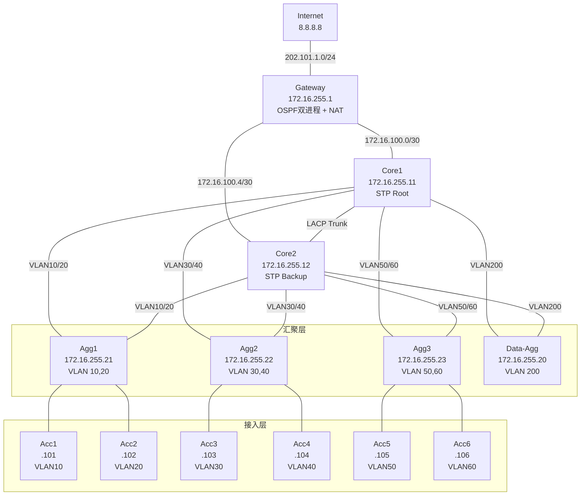

# H3C 园区网网络架构分析报告

> 基于 `docs/configs/` 中 14 台设备配置文件自动分析生成

---

## 1. 网络拓扑总览

---

## 2. 设备清单

| 主机名 | IP 地址 | 设备类型 | 角色 |
|--------|---------|----------|------|
| Gateway | 172.16.255.1 | 路由器 | 出口网关 |
| Internet | 8.8.8.8 | 路由器 | 模拟公网 |
| Server1 | 172.16.255.11 | 三层交换机 | 核心层 |
| Server2 | 172.16.255.12 | 三层交换机 | 核心层 |
| Server3 | 172.16.255.21 | 三层交换机 | 汇聚层 |
| Server4 | 172.16.255.22 | 三层交换机 | 汇聚层 |
| Server5 | 172.16.255.23 | 三层交换机 | 汇聚层 |
| Data-Agg | 172.16.255.20 | 二层交换机 | 数据汇聚 |
| Server6 | 172.16.255.101 | 三层交换机 | 接入层 |
| Server7 | 172.16.255.102 | 三层交换机 | 接入层 |
| Server8 | 172.16.255.103 | 三层交换机 | 接入层 |
| Server9 | 172.16.255.104 | 三层交换机 | 接入层 |
| Server10 | 172.16.255.105 | 三层交换机 | 接入层 |
| Server11 | 172.16.255.106 | 三层交换机 | 接入层 |

---

## 3. 网络规划

### 3.1 VLAN 与子网

| VLAN | 子网 | 网关 (VRRP VIP) | 用途 |
|------|------|----------------|------|
| 10 | 172.16.10.0/24 | 172.16.10.254 | 业务子网 1 |
| 20 | 172.16.20.0/24 | 172.16.20.254 | 业务子网 2 |
| 30 | 172.16.30.0/24 | 172.16.30.254 | 业务子网 3 |
| 40 | 172.16.40.0/24 | 172.16.40.254 | 业务子网 4 |
| 50 | 172.16.50.0/24 | 172.16.50.254 | 业务子网 5 |
| 60 | 172.16.60.0/24 | 172.16.60.254 | 业务子网 6 |
| 100 | — | — | 核心互联 |
| 200 | — | — | 存储/数据专用 |

> .254 为 VRRP 虚拟网关，Core1/Core2 实地址分别为 .252/.253

### 3.2 核心互联地址（/30 P2P）

| 链路 | 网段 | Gateway | Core |
|------|------|---------|------|
| Gateway ↔ Core1 | 172.16.100.0/30 | .1 | .2 |
| Gateway ↔ Core2 | 172.16.100.4/30 | .5 | .6 |

### 3.3 Loopback 地址

| 设备 | Loopback0 | 设备 | Loopback0 |
|------|-----------|------|-----------|
| Gateway | 172.16.255.1/32 | Agg2 | 172.16.255.22/32 |
| Core1 | 172.16.255.11/32 | Agg3 | 172.16.255.23/32 |
| Core2 | 172.16.255.12/32 | Acc1~Acc6 | .101 ~ .106/32 |
| Agg1 | 172.16.255.21/32 | Data-Agg | 172.16.255.20/32 |

### 3.4 公网地址

| 网段 | 设备 | IP |
|------|------|----|
| 202.101.1.0/24 | Gateway GE0/2 | 202.101.1.1 |
| 202.101.1.0/24 | Internet GE0/0 | 202.101.1.254 |

---

## 4. VRRP 冗余规划

| VLAN | VRID | 虚拟 IP | Core1 优先级 | Core1 角色 | Core2 优先级 | Core2 角色 | 主网关 |
|------|------|---------|-------------|-----------|-------------|-----------|--------|
| 10 | 10 | 172.16.10.254 | 120 | Master | 100 | Backup | Core1 |
| 20 | 20 | 172.16.20.254 | 100 | Backup | 120 | Master | Core2 |
| 30 | 30 | 172.16.30.254 | 120 | Master | 100 | Backup | Core1 |
| 40 | 40 | 172.16.40.254 | 100 | Backup | 120 | Master | Core2 |
| 50 | 50 | 172.16.50.254 | 120 | Master | 100 | Backup | Core1 |
| 60 | 60 | 172.16.60.254 | 100 | Backup | 120 | Master | Core2 |

> **负载分担策略**：奇数 VLAN (10/30/50) 由 Core1 承担主网关，偶数 VLAN (20/40/60) 由 Core2 承担主网关，实现流量负载均衡。

---

## 5. STP 生成树规划

| 参数 | Core1 | Core2 | 汇聚层 | 接入层 | Data-Agg |
|------|-------|-------|--------|--------|----------|
| 模式 | RSTP | RSTP | RSTP | STP (默认) | RSTP |
| 优先级 | 0 (Root) | 4096 (Backup) | 默认 (32768) | 默认 (32768) | 默认 (32768) |
| 全局使能 | 是 | 是 | 是 | 是 | 是 |
| 边缘端口 | — | — | — | GE1/0/2 (下游端口) | GE1/0/1 |
| 聚合口优先级 | Agg2 优先级0 | Agg2 优先级0 | — | — | — |

> **收敛策略**：Core1 为根桥（优先级 0），Core2 为备根桥（优先级 4096），接入层下行端口配置为边缘端口（快速进入转发状态）。

---

## 6. 路由规划

### 6.1 OSPF 进程分配

| OSPF 进程 | 运行设备 | Router-ID | Area | 用途 |
|-----------|---------|-----------|------|------|
| OSPF 1 | Gateway | 172.16.255.1 | Area 0 | 内部园区路由 |
| OSPF 1 | Core1 | 172.16.255.11 | Area 0 | 内部园区路由 |
| OSPF 1 | Core2 | 172.16.255.12 | Area 0 | 内部园区路由 |
| OSPF 1 | Agg1 | 172.16.255.21 | Area 0 | 内部园区路由 |
| OSPF 1 | Agg2 | 172.16.255.22 | Area 0 | 内部园区路由 |
| OSPF 1 | Agg3 | 172.16.255.23 | Area 0 | 内部园区路由 |
| OSPF 1 | Acc1~Acc6 | 对应 Lo0 | Area 0 | 内部园区路由 |
| OSPF 2 | Gateway | 202.101.1.1 | Area 0 | 公网路由（与 Internet 交换） |
| OSPF 2 | Internet | 8.8.8.8 | Area 0 | 公网路由 |

### 6.2 OSPF 1 宣告网络（部分设备）

| 设备 | OSPF 1 Area 0 宣告网络 |
|------|-----------------------|
| Gateway | 172.16.100.0/30, 172.16.100.4/30, 172.16.255.1/32 |
| Core1 | 172.16.10.0/24, 172.16.20.0/24, 172.16.30.0/24, 172.16.40.0/24, 172.16.50.0/24, 172.16.60.0/24, 172.16.100.0/30, 172.16.255.11/32 |
| Core2 | 172.16.10.0/24, 172.16.20.0/24, 172.16.30.0/24, 172.16.40.0/24, 172.16.50.0/24, 172.16.60.0/24, 172.16.100.4/30, 172.16.255.12/32 |
| Agg1 | 172.16.10.101/32, 172.16.255.21/32 |
| Acc1 | 172.16.10.104/32, 172.16.255.101/32 |

### 6.3 路由重分发

| 源进程 | 目标进程 | 方式 | 设备 |
|--------|---------|------|------|
| OSPF 2 | OSPF 1 | `import-route ospf 2` | Gateway |
| OSPF 1 | OSPF 2 | `import-route ospf 1` | Gateway |
| Direct | OSPF 2 | `import-route direct` | Gateway |

### 6.4 默认路由

| 设备 | 目的 | 下一跳 | 注入方式 |
|------|------|--------|----------|
| Gateway | 0.0.0.0/0 | 202.101.1.1 | `default-route-advertise always` (OSPF 1) |

---

## 7. 链路聚合规划

| 聚合口 | 所在设备 | 成员端口 | 模式 | 允许 VLAN | 对端推测 |
|--------|---------|---------|------|-----------|---------|
| Bridge-Aggregation2 | Core1 | GE1/0/1, GE1/0/2 | LACP 动态 | 全部 | Core2 |
| Bridge-Aggregation2 | Core2 | GE1/0/1, GE1/0/2 | LACP 动态 | 全部 | Core1 |
| Bridge-Aggregation3 | Core1 | — | LACP 动态 | 全部 | 下游汇聚 |
| Bridge-Aggregation1 | Agg1 | GE1/0/1, GE1/0/2 | LACP 动态 | 1,10,20 | Core1/Core2 |
| Bridge-Aggregation3 | Agg1 | — | LACP 动态 | 全部 | — |
| Bridge-Aggregation4 | Agg2 | GEO1/0/12,... | LACP 动态 | 全部 | Core1/Core2 |
| Bridge-Aggregation5 | Agg3 | GEO1/0/12,... | LACP 动态 | 全部 | Core1/Core2 |

---